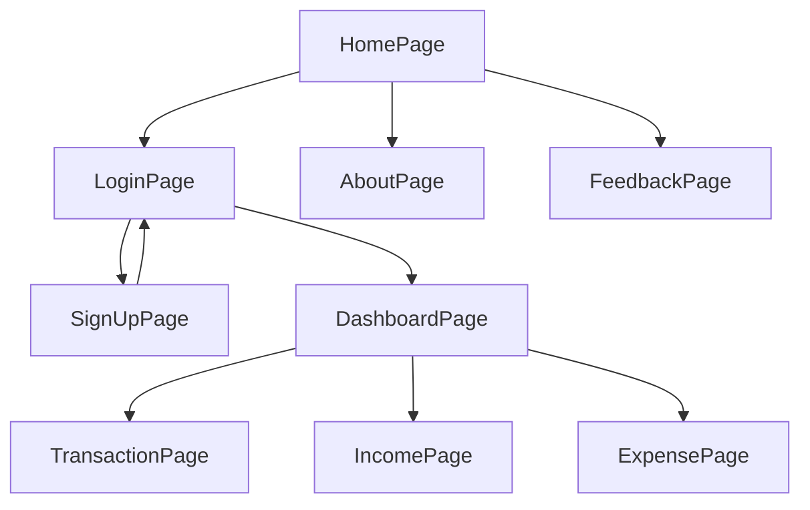

# Project Name 

 ## Fintrack
 

---

> ✨ABOUT 

⭕CHANDA KAUDI ,also known as Chaupar or Chaubara, is a traditional Indian board game that has been enjoyed enjoyed in India for centuries, and it is still played by many people today.

---

## 🔗 Collaborators Profile Links✨

| Collaborators | Github                                                                                                                                   | Linkedin |                                                                                                                                    |
| ------------- | ---------------------------------------------------------------------------------------------------------------------------------------- | ------------------------------------------------------------------------------------------------------------------------------------------------------------------- | -------------------------------------------------------------------------------------------------------------------------------------------- |
| Raj Gupta  (Member 1)| |  | 
|Somil Rathore (Member 2) |  |  |
| Mayank Digarse (Member 3) |  | |
| Neha Tomar (Member 4)|  | | 

 

💻 Project logo:- 

 

---

## 💫Tech-Stack->

- #### For Frontend :-
   - `HTML5`
  - `CSS3`
  - `JavaScript `

- #### For Database: -
   - `Local Storage `
  
- #### For live Project : -
   - `Netlify`

   

---

## Features ✨:-
---
 | Serial No            | Feature                                                              |
| ----------------- | ------------------------------------------------------------------ |
| 1 | User signup and Login |
| 2 | Landing Page , About page, Feed Back Page|
| 3 | Dashboard Page |
| 4 | View All Transaction Page ,Impressive UI|
| 5 | Navbar, Sidebar ,completely Responsive  |

## Flow

---
## Screenshots 📷
---

# Home Page

# Signup Page 

# LoginPage

# Dashboard Page

# Transaction Page

# Income Page

# Expense Page

---

<h1 align="center">✨Thank You✨</h1>
